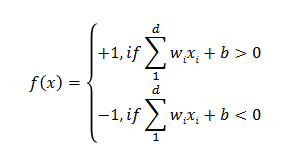

# Machine Learning for Data Science

## 1: Introduction/General:
### Different learning tasks:
#### Supervised Learning:
- description of instance and their class label available
- discrete class attribute
- goal: learn model from trainign data to map instance to class label
- Typical Examples: Classification (map to label), Regression(map to continuous class attribute), Outlier Detection
#### Unsupervised learning:
- only description of instance available
- no feedback/labels/class attribute, we don't know how many clusters may exist or their characteristics
- goal: discover structure, group similar instances
- Typical Examples: clustering, outlier detection (identification of non-typical data)

#### Reinforcement learning:
- agent learns in interactive enviroment by trial and error
- receives feeback as rewards

#### Lazy vs Eager learners:
1. Eager Learners:
   - constructs model based on training set, that is ready and eager to classify new instances
   - lot of work on training data, less on classifying new instances
   - examples: decision trees, SVM, MNB, neural networks

2. Lazy learners(also: instance based learners):
   - simply store data (with labels), waits until new instance arrives to be classified, no model constructed
   - less work on training data, more on classifying new 
   - examples: kNN

#### Generative vs Discriminative models: 
1. Discriminative: Try to find mapping h() that **seperates** different classes, new instances classified using h()
2. Generative models: try **build** model for each individual class, new instances tested against different models, most likely is class 

## 2: Data
### Preprocessing
- Why? data is noisy (errors, unexpected values, irrelevant information), incomplete (missing values/attributes), inconsistent 
- Tasks: integration, cleaning (fill missing values, smooth noisy data, find ourliers, resolve inconsistencies), reduction (eliminate duplicates)
- Beware! Data now already changed, eg mean imputation (replace missing values with mean) strengthens average
  
### Transformation: 
- Normalization in range to balance contribution
  
  specified new min and max
  
  converting to common scale with mean = 0 and std dev = 1
- generalization through concept hierarchy (milk 1,5% rewe = milk), Discretization

### Data Reduction:
- Aggregation (multiple -> average)
- Feature selection
- Dimensionality reduction
  
### Deriving(Extracting) features:
- necessary for complex objects (eg image, text)

### Feature Types:
- Binary: 2 values, symmetric if equally important, asymmetric else (eg medical test)
- Categorical - Nominal: set of states (eg color)
- Categorical - Ordinal: set of ranked/ordered states
- Numerical: Interval-scale: Differences meaningful, ratio not (eg Celsius)
- Numerical: Ratio-scale: eg age, length
  

### Data analysis:
#### Univariate desciptors:
- mean:

    
- weighted average:
  
    
- median: central element in ascending order
- mode: value that occurs most often
- skewness: distribution of values about mean (positive skewed: mean higher than mode <-> negative)
- measures of spread: 
  
  1: dispersion/variance:

  

  2: standard deviation (= sqrt of variance)
- charts: histograms, boxplots (mini, [first quartile, median, third quartile], max)
#### Bivariate Desciptors:
- numerical data: correlation coefficient between -1 and 1, -1 means strong negative correlation, 1 strong positive
  
- categorical data: chi-square using contingency table
  
  look up value in table of critical values with (rows-1)*(columns-1) degree of freedom

### Distance funtions for numerical:

### Proximity measures for binary:
- simple matching coefficient:
  
  
symmetric
  
  asymmetric
- Jaccard coefficient (asymmetric):
  
  
  
  with: 
  q = i = 1 and j = 1  
  t = i = 0 and j = 0  
  s = i = 0 and j = 1  
  r = i = 1 and j = 0

### Priximity measures for categorical (nominal):
- Simple matching with m = # matches and p = # total of variables:  

- Mapping to binary variables: create new binary attribute for each fo the nominal states

## 3: Classification
- Task T = find hypothesis $ h: X \rightarrow Y $
- Experience E = provided training Data
- Performance P measured by errors of $h()$:  
**loss of the learner/true error of h()** = probability of randomly choosing example x, where $h(x)\uneq f(x)$, but no access to f(x) 
**training error** (empirical loss)instead:  

- **Empirical risk minimization**: find $h()$ minimizing training error, caution: might lead to overfitting, we want classifier to perform well on traing data, but also likely over underlying data distribution
- General approach: Training Data $\rightarrow$ **Induction**(generalization from specific observation) $\rightarrow$ Learn Model $\rightarrow$  Model $\rightarrow$ Apply Model $\rightarrow$  Deduction (applying,testing theory)$\rightarrow$ future instances
  
### Avoiding Overfitting
Make assumptions about learner **= inductive bias**
- popular type: restricting $h()$ to hypothesis class H (eg assume $h()$ is decision tree,...)
- **ERM**: choose h with smallest training error
- other techniques: Regularization, Pruning, Early Stopping,...
- **Regularization:** control complexity, choose simple ones
- **Feature Selection:** Remove irrelevant feature
- more data,...

### Training and Testing set:
- Training: used to learn model, should be representative, samples follow **i**ndependent and **i**dentically **d**istributed assumption (training error)
- Testing: simulates future unseen instances, **only** used for evaluation, otherwise overfitting, disjoint from training set (generalization error)
- training and testing sets assumed from same distribution (stationary assumption) and disjoint
- we want both, low training and generalization error
- Validation set:
  used for parameter tuning, no tuning after applying models on testset!

### Decision Trees:
- representation: internal nodes with predictive attribute, branches corresponding to one value, leaf nodes assigning class label
- suitable if: small number of attribute values, discrete class atribute values, data might contain errors and missing values
  
#### Building decision trees:
- starting at root node: 1. choose splitting attribut, for each value create new node, sort to leaf nodes, repeat (if not perfectly classified)
  
#### choosing right splitting attribute:
1. Entropy for measuring impurity: 
 
small entropy = less impurity, high entropy = high information content

2. Information gain: 
 
measures expected reduction due splitting on A, high entropy reduction is chosen
- **eval:** biased towards attributes with large number distinct values (problem considering unique identifiers IDs)

3. Gain ration: 
 
select maximum gainration   
  
low means peaks, high = uniform distribution 
 
- **eval:**tends to prefer unbalanced splits, where one partition is much smaller than others

4. Gini Index: 
 
with p = probability of class j in S
 
Gini considers binary split for each attribute
 
we evaluate reduction in impurity, A providing smallest Gini(S,A) or largest reduction is chosen
- Attribute selection: 
  - for categorical: consider all possible subsets
  - for numerical: sort values in increasing order, identify targets where label changes(threshholds), compute gini to choose best
- **evaluation:** biased to multivalued attributes, difficulty with large # classe, favors equal-sized partitions with high purity

#### Hypothesis space and inductive bias:
h() represented by decision tree
Hypothesis class = set of possible trees
Search method: greedy, no backtracking
inductive bias: chooses first acceptable tree, high information gain close to root, prefers short trees

#### Decision boundary:
- with DTs, partitions rectangles **(decision regions)**, **decision boundary**: border line between neighboring regions
 
oblique decision trees: splitting criterion might involve 1+ attributes, diagonal decision boundary possible, but computationally more expensive

#### Overfitting
- results in too complex trees, very small decision regions
- causes: noise, lack of representative samples,...
- **Pruning:** 
  1. Pre-pruning: stop growing branch if providing not much information, but: can "stop early"
  2. Post-pruning: take grown tree and discard parts
   - methods: subtree replacement = replace subtree with one attribute value, subtree raising: delete higher node, raise subtree below
- evaluation: error-based(prune, if error does NOT increase, training data split into growing and pruning set), complexity-based (complexity penalty)
  

### k-Nearest Neighbor:
#### Overview:
+ lazy learners, arbitrarily shaped decision boundaries
- susceptible to noise, dependent on choice of distance function and k
- general idea: compare with most similar instances to classify
- Input: training set D (known class labels), distance measure, number of neighbors k
#### Classification: 
- compute distance to training records, identify k nearest neighbors, with class labels of neighbors: determine class (voting)
- Definition of k: to small? high sensitivity to outliers, to large? many objects from other classes in neighborhood
-neighborhood voting: 
  majority voting: take majority class label, all neighbors contribute equally
  weighted voting: each neighbor contributes with weight proportional to distance

#### Decision Boundary:
can be arbitrarily shaped, become complex with large training set (with 2 points just a line)

#### issues:
- Efficiency: 
  - Lazy Learners, classifying new records relatively expensive
  - possible solutions: use projections on dataset (partial distance computattion)
- Different value ranges -> normalization
- Dimensionality: distance functions loose discriminative power in high-dimensional spaces, solution: Dimensionality reduction, working in subspaces

### Bayesian classifiers:
- probabalistic framework for solving classification problems: predicts membership probabilities for instance

Bayes' theorem: 
 

with $P(X_1|c) = \frac{n_{1c}}{n_c}$
$n_c = $# instances in class c
$n_{1c} = $ # instances in class c having value $X_1$

Bayes classification:
 ,
with multidimensional data:
 

#### Naive Bayes classifier: 
+ easy to implement, well in practice, robust to irrelevant attributes, can handle missing values, robust to noise
- strong independence assumption
assumes strong independence among attributes, then:
 

The **zero frequency problem**: in Naive Bayes, each conditional probability has to be non-zero, otherwise everything = 0 $\rightarrow$ Laplace correction 
 
with k = number of classes

Inductive bias of NBs:
- assumption of independence, but necessary to make generalization feasible

#### Bayesian Belief Networks BBN:
- allow to represent class conditional independence between subsets of variables instead of all, represented in acyclic graph
- each variable has conditional probability table
 

## Evaluation of classifiers:
- $\rightarrow$ training and testing set
- useful tool evaluation: confusion matrix
 

### Evaluation measures:
1. Accuracy: % instances correctly classified
  $accuracy(M) = \frac{TP + TN}{P + N}$
2. Error rate: % instances misclassified
   $error\_rate (M) = \frac{FP + FN}{P + N}$
**more effective for relatively balanced class distribition**, if imbalanced:
3. Sensitivity/recall: % positive tuples correctly classified:
   $sensitivity(M) = \frac{TP}{TP + FN}$
4. Specificity: % negative toples correctly classified
   $specificity (M) = \frac{TN}{TN + FP}$
5. Precision: % instances classified positive and actually positive
   $precision (M) = \frac{TP}{TP + FP}$

6. F-measure/F1 score: harmonic mean precision and recall
   $F(M) = \frac{2 \cdot precision(M) \cdot recall(M)}{precision(M) + recall(M)}$
7. $F_ {\beta}$-Measure: weighted measure of precision and recall
   $F_ {\beta}(M) = \frac{(1 + \beta^2)\cdot precision(M) \cdot recall(M)}{\beta^2 \cdot precision(M) + recall(M)}$

8. ROC curve
 
- **AUC** = Area under the curve, the higher the better
- how to create curve: classifiers like DT single confusion matrix $\rightarrow$ 1 ROC point, other like NB creating value representing degree instance member of class can be used with different threshholds $\rightarrow$ more points on ROC curve

### Evaluation Setup: How to create training and test set
#### Holdout method:
given data randomly partitioned in 2 independent sets (2/3) training, (1/3) test
+ no computational effort
- relies on how data divided, less data for training

#### k-fold cross validation:
randomly partition Data in k exclusive equal sized subsets, trainig and testing is performed 10 times
- stratified vs random sampling: stratified = reproduction of distribution class labels in test set

#### Fairness-aware evaluation: 
goal of traditional classifier is find hypothesis minimizing empirical errors $\rightarrow$ underrepresented classes

### Support Vector Machines:
assumption: classes are linearly separable $\rightarrow$ idea: line between them = deicsion function
 

+ High accuracy classifier, weak tendency of overfitting, efficient in classifying new objects, compact models
- costly implementation: somtimes long training, learned model difficult to interpret

#### Finding seperating hyperplane:
- lots of possible solutions, goal is to find hyperplane with largest minimum distance to training instances, $2 \cdot$ this distance = **margin**
- decision function fully specified by subset training samples **support vectors** closest to decision boundary

#### Hard-margin Linear SVM:
 
 
= calculation example, using lagrange multiplier, support vectors are those where lm $\neq$ 0, classification of point given by sign

#### Soft-margin linear SVM:
- might prefer solution better seperates bulk data ignoring few noise points $\rightarrow$ relax constraints by introducing slack variables $\xi_i \geq 0$ 
  

#### Nonlinear SVM:
- sometimes no linear decision boundary $\rightarrow$ trick: transform data into new space $\Phi (X)$ where linear db can be used, transformation leads to more dimensions $\rightarrow$ more complex calculations
- kernel trick: compute dotproduct in transformed space using original attribute set $K(u,v) = \Phi(u)\cdot \Phi(v)$
  
### Perceptron (neural networks):
- imitate human brain, mathematical function of biological neuron: vector of inputs, calculates linear combination, adds bias, passes value through stepfunction
  
learns from examples (labeled or not), works even if one of neurons damaged

+ usable for high dimensional, noisy, imprecise or imperfect data/ lack of clear mathematical solution

#### Learning rule:
learns weights for input signal to draw decisiion boundary:
1. Initialize weights to 0 or small value
2. For each training example $x_i$: 
   2.1 calculate output $o_i$
   2.2 update weights with:
   $w_j = w_j + \Delta w_j$ where $\Delta w = \eta (y^i-o^j)x^i_j$
when predictions correct, weights don't change, perceptron converges

#### Problems:
when classes are not linear separable no converging $\rightarrow$ linear activation function, minimize sum of squared errors (SSE) for updating weights
gradient descent to minimize SSE: 
$\Delta w_i = \eta (t - o) x_i$ with t = target value and o = output

##### (batch) Gradient descent training:
1. weights initialized to zero
2. for each training instance: $\Delta w_i \leftarrow \Delta w_i + \eta (t - o) x_i$
3. for each weight: $w_i \leftarrow w_i + \Delta w_i$

##### Incremental/Stochastic gradient descent:
like other, but in second step: weight update instead of delta update $w_i \leftarrow w_i + \eta (t - o) x_i$

#### beyond:
when classes are not seperable: multilayer perceptron with hidden layers, with backpropagation for weight updates

## 3. Regression:
supervised learning with continuous class attribute

### Problem formulation:
Task T = prediction of real value y, learning function h()
Experience E = labeled training instances
Peformance P = loss functions (absolut loss, squared, 0/1)

### Univariate linear regression:
looking for linear function with form $f_w(x) = w_1 \cdot x + w_0$, how to find best line? minimize empirical loss, eg with gradient descent

#### Polynomial regression
in general: relationship modeled with n-degree polynomial, but beware: the more complex the model (higher n) the higher the risk of overfitting $\rightarrow$ $Cost(h) = Loss(h) + \lambda Complexity(h)$ 
Complexity function regularizes, there is L1 and L2 regularization

### Multivariate linear Regression
- in n-dimensional space: multivariate linear function
- same procedure to avoid overfitting

### Linear classifiers with hard/logistic threshold:
linear functions can also be used for classification (eg perceptron)
stepfunctions with hard threshold cause convergence problems $\rightarrow$ soft threshold, eg sigmoid function
process of weightfitting = logistic regression

## 4. Clustering:
= unsupervised learning
Task: group objects so that objects in same group are similar = high **intra-cluster similarity** and objects in other groups are different = low **inter-cluster similarity**
- Outliers vs Clusters: might be objects not belonging to any clusters, can be removed at preprocessing, some clustering algorithms identify them, some cases we are more interested in detecting outliers than in clusters
- **labeling**: after extracting we typically want to describe in human interpretable way:
  - extensive description (enumerate members)
  - intensive/ cluster labeling (more abstract descriptions of properties of members)
  - depends on data types, extra information (labels, not used for clustering), with numerical data typically described via center and radius
  
### Partition based:
partition data into several clusters based on some criterion eg minimize errors
hard/crisp: each instance belongs to one cluster

#### k-Means:
- given D and k: choose k points to form clusters, such that clustering cost C minimized
- C = aggregated intra-cluster distance = $Cost(C) = \sum_{i=1}^k \sum_{x \in C_i}$ $\rightarrow$ 

- convergence to **local optimum**, dependent on initialization (non-deterministic)
- sensitive to outliers, noisy data centers are affected
- not suitable to find non-convex shapes
+ Complexity: $O(tkn)$ with t = iter $\rightarrow$ relatively efficient

- variances: different initialization (multiple runs, no random,...) different mean calculating, for categorical: k-modes

##### k-Means algorithm (Lloyd):
1. randomly pick k objects as cluster centers
2. assign each point to closest cluster center
3. update each cluster center based on new points
4. repeat until convergence (eg cluster centers don't change, cost not significantly improved, max iter)

##### k-Means algorithm (MacQueens)
like other version, but centroids recalculated every time point is moved

#### k-Mediods:
instead of taking mean as center, instances are used
1. select k representative objects
2. repeat:
   - assign rest to clusters
   - for each mediod m and non-mediod o: check if o could replace m improving clustering cost
...until no improvements achievable

- Complexity: $O(k(n-k)^2) \rightarrow$ well for small data but doesn't scale well
- more robust to outliers

#### Selecting k:
- Silhouette coefficient of cluster: measures how tightly grouped cata in cluster, >0.7 strong, >0.5 usable 

### Hierarchical:
produces set of nested clusters organized as hierarchical tree, instance can belong to multiple clusters but still hard assignement

- Complexity: $O(n^2)$ proximity matrix $\rightarrow O(n^3)$

+ no assumption about # clusters necessary
- always local decisions, inefficient

#### Methods:
- Agllomerativ: bottom-up approach, start with points as individual clusters, at each step: merge closest pair
- Divisive: top-down approach, start wih one all-inclusive cluster, at each step: split until single points
- key operation: proximity calculation between 2 clusters
  
#### Distances:
- Single link/MIN: min distance between any object in $C_i$ and $C_j$: $dis (C_i, C_j) = min_{x,y}\{d(x,y)|x \in C_i, y \in C_j\}$
  - sensitive to outliers, creates different shapes
- Complete link/MAX: max distance between any object in $C_i$ and $C_j$: $dis (C_i, C_j) = max_{x,y}\{d(x,y)|x \in C_i, y \in C_j\}$
  - less susceptible to noise/outliers, creates clusters of similar diameter
- Group average: average distance between any object in $C_i$ and $C_j$: $dis (C_i, C_j) = \frac{\sum_{x \in C_i, y \in C_j}d(x,y)}{|C_i||C_j|}$
- Centroid: $dis (C_i, C_j) = d(c_i,c_j)$

#### Bisecting k-Means:
combines k-means and hierarchical clustering, split in 2 clusters, choose on for further splitting until k cluster

### Density-based:
clusters = regions of high density surrounded by low density (noise), density measured locally in eps-neighborhood of each point

- Complexity: $O(n^2)$

+ clusters of arbitrary shape, handling noise, no assumption about # cluster
- non-deterministic (DBSCAN): border points might change membership depending on processing order, problems with high-dim data, fails identify clusters of varying densities
  
#### DBSCAN:
- Dataset D, Eps/$\epsilon$: max radius of neighborhood, MinPts: min number of points in **Eps-neighborhood** = $N_{Eps}(p) = \{q belongs to D | dist(p,q) \leq Eps\}$ 
- **Core point** = $|N_{Eps}(p)\geq MinPts$
- **Border point** = $|N_{Eps}(p)\leq MinPts$ but p in neighborhood of core point
- **Noise point** = neither core nor border point
- p is **Directly density-reachable** from q if $p \in N_{Eps}(q)$ and  $|N_{Eps}(q)\geq MinPts$
- p is **density-reachable** from q if there is directly reachable chain
- p is **density-connected** to q, if p and q density-reachable from each other
- **Cluster** is maximal set of density connected points
  
##### Algorithm:
1. random p
2. retrieve all points density-reachable from p
3.a) if p = core point: cluster formed starting with p
3.b) if p = border point: no points density-reachable, next, until all processed

### Grid-based
grid structure to capture density, measured locally in each cell, cluster = max set of connected dense cells 

+ clusters of arbitrary shape, handling noise, no assumption about # cluster
- dependent on typically global parameters(cell size, cell density)

### Model-based/Soft Clustering:
if clusters overlapping, membership for 1+ cluster with membership probability, model used for hypothesis

- Data D, clusters each represented via eg Gaussian distribution:
  - mean $\mu _c$ (expected value, vector in multivariate cas)
  - variance $\sigma _{c}^2$ (univariate) or covariance matrix(d \times d) for correlations of attributes in multivariate case
$\rightarrow$ how to determine parameters?

#### Expectation Maximization 
problem(chicken-egg): need parameters to guess source of point, need sources points to estimate parameters

Algorithm:
start with random parameters
1. **E**xpectation: for each instance: probability of coming from each source with current parameters
2. **M**aximization: re-estimate parameters based on assignments
...until convergence

- similarity to k-means: assigning to cluster, then refining cluster representation

## 5.Clustering Evaluation:
### Internal measures:
measure without external information
1. Cluster Cohesion: How closely related are objects in cluster?
$WSS = \sum^k_{i=1}\sum _{x\in C_i}(x-c_i)^2$ with $c_i$ = centroid
2. Cluster seperation: How well seperated is cluster from others?
$BSS = \sum _i |C_i|(c-c_i)^2$ with c overall mean
3. Silhouette coefficient: combines cohesion with seperation, between -1 and 1 = best
can be used evaluating # clusters

### External measures:
measure extent to which discovered clusters match externally supplied label
1. Entropy: how pure in terms of classes is cluster?
2. Purity: focuses on most likely class in cluster, how likely is maj class?

## 6. Outlier Detection:
- goal: find objects different from most others, unusual or inconsistent
- Standalone task (anomalies are focus), pre-processing (improve data quality), post-processing (improve pattern quality)

- causes of anomaly:
  - data from different class
  - natural variation
  - data measurement or collection errors

- variants:
  - compute anomaly score for instance
  - detect all anomalies wrt threshold t
  - detect top-n anomalies in dataset

- supervised (training data for normal and abnormal) goal = classify instances as anomaly or not
- unsupervised (no training data), most common, assign score to instance
- semi-supervised: only training data for normal or abnormal

- Global vs local:
  - global = reference set with all objects, assumption: only 1 normal mechanism, problem: dataset includes other outliers, may falsify
  - local = small subset, no assumption on # mechanisms, problem: how to choose set?
- Labeling vs Scoring:
  - labeling: binary output
  - scoring: continuous outlier score

general steps: build profile of "normal" behaviour, use it to detect anomalies

### Model-based/Statistical:
- data model built assuming certain distribution (eg Gaussian), outlier is object with low probability
- global method, model sensitive parameters are computed for dataset including outliers

### Distance-based:
- assuming point is outlier if distant from others, less dense neihborhood, points are judged based on distance using one proximity measure
- simple but expensive, sensitive to parameter choice, curse of high dim

### Density-based:
- assuming point is outlier if on region of low/different density, density around point compared to density around local neighbors
- Local Outlier Factor (LOF)
- can manage different dense clusters

### Clustering-based approaches:
- point is outlier if not strongly part of cluster, $rightarrow$ find clusters, compute distance non-cluster-points to clusters
  
### Outlier Evaluation:
- labels provided: similar to classifier evaluation, precision and recall appropriate
- without labels: could check improvement of model after removing

## 7: Reinforcement Learning
- indirect-feedback: instead of proper action, evaluation of chosen action given
- **agent** learns in an interactive **enviroment** by trial and error, using feedback from own actions end experiences
- at each step: agent executes action $a_t$ transitions to state $s_t$ receives reward $r_t$

### Characteristics: 
- Non-deterministic: actions might result in multiple states
- sequential decision making: short-term actions have long-term consequences, actions affect subsequent receiving data
- online vs offline/batch: learn while exploring or from fixed data
- active vs passive learning: active action choosing or fixed policy?
- model-based vs model-free: do we estimate T and R or just learn values/policy directly?
  
### Exploitation vs Exploration:
- Exploitation = make best decision given current information
- Exploration = gather more information could lead to better decisions
- $\varepsilon$-greedy policies: explore with prob $\varepsilon$ and exploit with prob 1-$\varepsilon$
- Exploration function: better to explore not established areas
- Regret: measure of total mistake cost = difference between reward of optimal policy and yours, random exploration higher regret 

### Generalizing accross states
- in realistic situations: not possible to learn about every situation
- solutions: estimate valuefunction with function approximation, generalize from seen to unseen states
- features used to represent states, *handcrafted* features or *learned* features (automatically obtained by ML algorithm)

  
### Markov Decision Problem formulation:
Input:  - set of states $s\in S$
        - set of actions $a \in A$
        - Transition model: $T(s,a,s')$ = probability $s'$ reached if $a$ taken in $s$
        - Reward function: $R(s,a,s')$, **utility** = sum of rewards
- Environment history: sequence of states experienced by agent
- policy $\pi: S \rightarrow A$ defines agents behaviour for each state, deterministic, optimal policy $\pi^*$ yields highest expected utility = **output** = 
- discount factor $\gamma \in [0,1]$ to prefer short term rewards
- **V-Value** evaluates state, predicts future Reward, $V^+(s)$ = expected utility starting in s acting optimally
- **Q-state** = action a taken in s, value = **Q-value**, $Q^*(s,a)$ optimal expectation

- **not RL**, there we don't know T, R

#### Bellman equations:
$V^*(s) = max_a \sum_{s'} T(s,a,s') \cdot (R(s,a,s')+ \gamma \cdot V^*(s')) $
$Q^*(s,a) = \sum_{s'} T(s,a,s') \cdot (R(s,a,s')+ \gamma \cdot V^*(s'))$
$V_{k+1}(s) \leftarrow max_a \sum_{s'} T(s,a,s') \cdot (R(s,a,s')+ \gamma \cdot V^*(s'))$

policy extraction: given optimal values, what is best policy? $\pi^* = arg max Q^*(s,a)$
= solving MDPs with Value iteration, approximations get refined towards optimal values, every iteration updates utilities and policy

#### Policy iteration:
1. policy evaluation: calculate utilities for fixed policy $\pi ()$ until convergence
  $V_{0}^{\pi} = 0$
  $V_{k+1}^{\pi} \leftarrow \sum_{s'} T (s, \pi(s), s') \cdot (R(s,\pi(s),s') + \gamma \cdot V_{k}^{\pi}(s'))$
2. policy improvement: update policy with converged (but not optimal!) values
   $\pi_{i+1}(s) = max_a \sum_{s'} T(s,a,s') \cdot (R(s,a,s')+ \gamma \cdot V^{\pi _i}(s'))$

### Model-free learning:
learn v-values and q-states directly, without constructing model of rewards and transitions in MDP

#### Direct evaluation:
agent learns from experience given in **episodes** while following given $\pi$
$U[s_0,s_1,...] = R(s_0) + \gamma R(s_1) + \gamma^2 R(s_2) + ... $
estimate values: total reward / times visited
= batch(episodes), passiv, model-free approach 

#### Temporal Difference Learning:
##### TD V learning
learn (update V(s)) from every experience (sample)
$V^\pi(s) \leftarrow (1 - \alpha) V^\pi(s) + \alpha (R(s,\pi(s),s') + \gamma \cdot V^{\pi}(s'))$
- **on-policy learning**: policy $\pi$ followed, information about policy dependent sampling not used to improve it, **online learning**: learn with each sample

##### TD Q learning
update Q(s,a) from every sample
$sample = R(s,a,s') + \gamma max_{a'}Q(s',a')$
$Q(s,a) \leftarrow Q(s,a) + \alpha (sample - Q(s,a))$
- **off-policy learning**

- model-free way to do policy evaluation, but to turn values into policy again need max over all

  
#### Q-Learning: 
= active RL

### Model-based learning
learn approximate model of T,R based on experience, solve MDP with learned T,R

#### Monte-Carlo policy evaluation/ MC-learning:
- batch approach: data collected (experience comes in full episodes), learns values at end of training
- passive: fixed policy $\pi$ given, each time $s$ visited, kepp track of rewards average in end -> **model-free** learns value of states directly

### Approximate Q-Learning with linear functions
$Q(s,a) = w_1f_1(s,a) + w_2f_2(s,a) + ... + w_nf_n(s,a)$
$sample = R(s,a,s') + \gamma max_{a'}Q(s',a')$
$difference = sample - Q(s,a)$
$w_i \leftarrow w_i + \alpha (difference)$

## 8: High dimensionality (feature selection)
- examples of high dimensional data: images, gene expression: data dim > sample size
- approaches: feature selection, dimensionality reduction, learning in subspaces

### Challenges due to high dimensionality: 
- **curse of dimensionality** = problem finding structure
1.  distance/similarity functions loose discriminative power, distances converge
2.  noise from irrelevant features dominates signal from relvant ones
3.  more features $\rightarrow$ larger hypothesis space $\rightarrow$ harder to find correct one
4.  patterns hard to interpret
5.  limited efficiency
6.  pattern might be only observable in subspace

### Feature selection:
- Task: given problem in feature space F and learning task, remove **irrelevant** (= not useful for learning) and/or **redundant**(may be redundant when strong correlation to other features) features from F
- can improve efficiency, quality of models and interpretability of results
- Formal:
  - input: D in d-dimensional feature space $F = {f_1, f_2,..., f_d}$
  - output: *minimal* ($2^d$ possible solutions) subspace $F' \subseteq F$ *optimal* (depending on learning task) for given learning task
- often exponential problem, k = |$F'$| given in many cases

#### Components:
1. Feature subset generation (which subspaces to check?)
   single dimensions or combinations?
2. Feature subset evaluation
   how to evaluate subspace? important scores lik information gain, $X^2$/performance of learning algorithm

#### Methods:
1. Filter methods:
   - explore general characteristics of data, independent of learning algorithm
   - assign "importance" score (eg info gain, $X^2$) to each feature to filter out useless ones
   + fast and simple
   - interactios between features not considered, features might be relevant as combination

2. Wrapper methods:
   - performance of learning algorithm used for subspace evaluation, determination of quality of features
   + considers dependencies, interaction between feature subset search and model selection
   - high risk of overfitting, computationally intensive  

3. Embedded methods:
   - integrate feature selection in model building process
   - eg decsision tree: at each node feature selected
   + less computationally intensive than wrapper
   - specific to learning method

### Forward selection and Feature Ranking:
- Input: supervised learning task (training set)
- compute how relevant each dimension for predicting label (eg iformation gain, $X^2$,...), sort dimensions accordingly, select k best
+ efficient
- subspace might contain correlated features, independency assumption

### Backward Elimination:
- start with complete feature space and remove redundancies
- before: subspace quality evaluation
  - Distance-based: distance between nearest in-class and nearest other-class object
  $q(U) = \frac{1}{|D|} \cdot \sum_{X\in D} \frac{NN^{U}_{y' \neq y}(X)}{NN^{U}_{y}(X)}$
  - Model-based: data mining algorithm to evaluate subspace, eg Naive Bayes
+ considers dependencies, redundancies can be eliminated
- evaluation much effort 
  
#### Branch and Bound Search
- start from full set, remove features depth-first strategy (assumption: monotonicity = $U_1 \subset U_2 \implies IC(U_1) \geq IC(U_2)$)
- quality measure: Subspace Inconsistency (IC)
$IC_U(A) = X_U(A) - max_{c \in C}X^c_U(A)$
$IC(U) = \frac{\sum_{A\in DB}IC_U(A)}{|DB|}$
with $X_U(A)$ # identical vectors A in U and $X^c_U(A)$ # identical vectors having label c 

#### randomized k-dimensional subspace projection
select n random subspaces with dimensionality k, select best
- Genetic Algorithms for feature selection:
  select subspaces with quality measure over threshold, copy into next generation, Mutation: d_i is replaced by d_j with p%, Crossover: Combine U_1,U_2 and delete random dimensions until dim = k
- Feature-clustering: cluster features, select one representative feature for each cluster
  

## 9: Velocity/Stream classification:

### contrast: traditionally batch learning
- complete dataset available, accessable multiple times
- assumption: data comes from stationary distribution
- BUT: data is never ending, generated over time

### Data streams:
- Characteristics:
  - Huge volume of continuous, possibly infinite data
  - high arrival rate: response time matters
  - non-stationary/evolving data
- model adaptation in stream learning: 1) incorporating new instances $\rightarrow$ incremental models !used by typically all! 2) eliminating outdated information $\rightarrow$ forgetting
- challenges incorporate new and discard old information, while access to data is limited: resource constraints (low processing time aimed), single scan of data (one look when data arrives, nor random access)
  
#### Forgetting:
- only interested in recent history of data stream, either forget data, or forget parts of model
1. forgetting data
   - in windows: landmark: include all objects from point x, sliding: remember n (window size) recent entries
   - via ageing: subjects assigned to fading function, weight decreasing with time, eg $f(o,t) = e^{-\lambda(t-t_0)}$ = damped window model!
2. forget model: eg decision tree, subtrees($\rightarrow locally$) or root ($\globally$) that don't perform well are relearned

### Data stream classification Basics:
- Concept drifts: = phenomen of change in data distribution
  - virtual concept drift: p(X) changes without affecting p(y|X), only input change
  - real concept drift: p(y|X) changes with or without change of p(X)
  - drift implying gradual, shift abrupt
- classification task: given infinite sequence of (x,y) find f(x) = y for unseen instances

#### Decision tree:
General problem: traditional tree needs whole dataset to determine splitting attributes

1: Hoeffding Tree 
- **incremental** method, historical data dominates decisions, trees become very complex
- small subset may be sufficient, how big? $\rightarrow$ Hoeffding bound
- algorithm: see n instances, two most suitable attributes, if $G(A)-G(B)\geq \varepsilon$ split based on A
- but: if 2 Attributes very similar G(), wastefully many examples required
- other versions: adaptive size (ASHT) = max size, tree reset if limit reached (global forgetting), concept-adapting (local forgetting) replaces subtrees with new ones, ensemble of trees(bagging = uniform distribution) of various sizes

#### Evaluation:
1: Holdout evaluation:
2 seperate datasets, one training(dynamic) one testing(static from beginning or dynamic)

2: Prequential evaluation:
one dataset for training and testing (both dynamic), model tested **then** trained on each instance, $\rightarrow$ all data fully used

##### Measures:
Cohen's kappa measure: $k = \frac{p_o-p_c}{1-p_c}$ 
$p_o = \sum^k_{i=1}P(\hat{y} = i| y = i)$ = correct predictions
$p_c = \sum^k_{i=1}P(\hat{y} = i)P(y = i)$ chance/random agreement

#### SAmKNN:
= kNN with Self Adjusting Memory
- Basic idea: seperated memories for current and past knowledge with different conservation spans
  
- memories represented by sets $M_{ST}$ current knowledge, $M_{LT} compressed past knowledge not contradicting $M_{ST}$, M_{C}$ as union and each with own corresponding kNN model

##### Key operations:
1. STM adaptation:
   - STM as dynamic sliding window with focus on current
   - concept change? $\rightarrow$ different new sizes evaluated, STM adjusted to size with min error, new idea transferred to LTM
   - no information should be lost! if STM shrunk, data $\rightarrow$ LTM

2. Cleaning and transferring:
   - LTM should be consistent with LTM $\rightarrow$ cleaning operation
   - for each instance $(x_i,y_i)$ to be transferred: 
    1.determine kNN in STM in same class 
    2. distance to kth nearest = $\theta$
    3. find $\theta$-neighborhood in LTM, remove instances with different class (local forgetting)

3. Compression of LTM:
   - max size reached, LTM data compressed
   - using clustering within same class, with k so instances are reduced by half $\rightarrow$ LTM = mix of real and compressed(cluster centers) points

4. Prediction
   - each model contributes final prediction with weight representing accuracy of model on recent data, model with highest = final

#### MNB - Incremental Multinomial Naive Bayes
- motivation: in discussions, new words are introduced, for same word sentiment changes, words different meanings in different contextes $\rightarrow$ model determining positive/negative? should adapt on changes
- Adaptation by **adding new instances**: for classes/word-class pairs timestamps, allows differentiation of observations based on recency
- Adaptation by **forgetting** /downgrading estimates: strategy: gradual ageing with exponantial fading function

#### Online Deep Learning: Learning Deep Neural Networks on the Fly
- in traditional approaches: fixed network structure
- fixed number of layers which seperate classifier on each, use parameters of hidden layers so far, with increasing depth: more previous information used, finally: prediction results aggregated and weighted for final decision

### Data Stream Clustering
- challenges: 
  - traditional clustering needs access on whole dataset, works with summaries rather than raw data
  - clustering structure needs to be adapted if concept drift
  - role of outliers/clusters often changed, need to be timely accurate identified 

#### Summarization
- one solution for dealing with efficiency requirements
- main idea: summarize/compress input into set of summaries and discard original data, apply algorithms on summaries
- lossy but still good representation
##### Cluster-feature (CF) vectors/BIRCH algorithm
- cluster feature vector summaries organized into tree structure
- with N d-dimensional points of cluster C, the CF vector is defined as triple: 
$CF = (N, \overrightarrow{LS}, SS)$
where: 
  - N = |C|
  - $\vec{LS} = \sum_{i=1}^N\vec{X_i}$ the linear sum of N data points
  - $SS = \sum_{i=1}^N\vec{X_i^2} = \sum_{i=1}^N \langle X_i,X_i \rangle$ the square sum of N data points
- compression is also **sufficient to compute measures needed for clustering**:
  - centroid of C: $\frac{\vec{LS}}{N}$
  - radius of C: $\sqrt{\frac{SS}{N}-(\frac{LS}{N})^2}$
  - diameter of C (avg pairwise distance within cluster): $D = (\frac{\sum_{i=1}^N\sum_{j=1}^N(\vec{X_i}-\vec{X_j})^2}{N(N-1)})^{\frac{1}{2}}$
  
additivity: two disjoint clusters $C_1$ and $C_2$
$CF(C_1 \cup C_2) = CF(C_1) + CF (C_2) = (N_1+N_2, LS_1+LS_2), SS_1 + SS_2$

incremental: addition of a new point
$CFT(C_1 \cup p) = CFT(C_1) + p$

#### incremental clustering: incDBSCAN
goal: update old clustering based on new data without reclustering from scratch (reorganizes **locally**, only affected cluster)
random access on raw data needed!

incremental vs stream:
- incremental needs access to raw data to update old clustering and ends up with exact solutions, might be appropriate for dynamic data arriving at low rate
- stream doesnt assume random access, typically approximate results

#### Partitioning methods:
##### adaptive methods:
1. Leader: single-pass algorithm: when new instance p arrives
  - find closest cluster, 
  - assign p to it if distance is below threshold d 
  - otherwise new cluster with p 
  
  - fast, but: number of clusters not controllable, order of example matters 

2. STREAM k-Means: iterative approach of k-Means not possible with streams, idea: use buffer, process stream into chunks $X_i$
   - for each $X_i$: apply k-Means locally (retain only cluster centers)
   - $X^{'}$ = cluster centers seen so far, treated as point with weight corresponding to assigned points
   - apply k-Means on $X^{'}$ for clustering result
  
   - number of clusters controllable butt fixed (k each)

##### Online summarization - offline clustering methods
CluStream:
- two components: **online** micro-cluster summarizing stream locally and **offline** macro-cluster clustering summaries into global clusters 
- summary structure CFT: for set points arriving at time points $T_1,T_2,...,T_n$
- CFT = ($SS^X, LS^X, SS^t LS^t, n$):
  - $SS^X = \sum_{i=1}^N\vec{X_i^2}$
  - $LS^X = \sum_{i=1}^N\vec{X_i}$
  - $SS^t = \sum_{i=1}^N\vec{T_i^2}$
  - $LS^t = \sum_{i=1}^N\vec{T_i}$
  - n = # points
- properties of microclusters: incrementality, additivity and subtractivity
- algorithm:
  - input: stream, q = #micro-clusters to be maintained, t = radius factor
  1. Initialization: offline on initNum points with applying k-Means to create CFT for each discovered cluster
   
  2. Online cluster maintenance: for each new p
   - distance between p and q cluster centroids, clu = clostest to p
   - find max boundary of clu = factor of radius
   - if p in boundary: absorbed by clu, clu updated
   - else: new microcluster p initialized, either delete one obsolete old cluster or merge (the 2 closest) to keep fixed q
  
  3. Periodic storage: micro clusters stored as snapshots
  
  4. Offline macro-clustering: on user demand
   - input: time horizon h, # macro clusters, current Time
   - 1: locate valid micro clusters during h
     2: apply k-Means upon these $\rightarrow$ k macro clusters

- discussion: one pass over raw data, stream rather changing process than clustering whole stream, flexibility, can find clusters over different time horizons, but: fixed number maintained, sesitive to outliers
  
#### Density based methods:
appealing for streams, as no assumption about # clusters, handling of noise and outliers

##### DenStream: 
###### Summarization: 
micro-cluster summary at time t for set of points arriving at time points $T_1,T_2,...,T_n$: $MC = (CF^1, CF^2, w)$
   - $CF^1 = \sum_{i=1}^n f(t-T_i)p_i$ 
   - $CF^2 = \sum_{i=1}^n f(t-T_i)p_i^2$
   - $w = \sum_{i=1}^n f(t-T_i)$
  
   - Center: $c = \frac{CF^1}{w}$
   - Radius: $r = \sqrt{\frac{CF^2}{w}-(\frac{CF^1}{w})^2}$
  
   - incrementality: $c + p = (CF^1 + p, CF^2 + p^2, w + 1)$
   - if no point is added to c for time interval $\delta t$, decay is applied: $c = (2^{-\lambda\delta t}\cdot CF^1, 2^{-\lambda\delta t} \cdot CF^2, 2^{-\lambda\delta t} \cdot w)$

Core, potential core and outlier summaries:
user-defined parameters: $\mu$: density threshold, $\varepsilon$: radius threshold, $\beta$:$\beta \cdot \mu$ density threshold for potential-core microclusters
- core: $w \geq \mu$ & $(r \leq \varepsilon)$
- potential-core: $w \geq \beta \cdot \mu$ & $(r \leq \varepsilon)$, $0 < \beta \leq 1$
- outlier: $w < \beta \cdot\mu$ & $(r \leq \varepsilon)$, $0 < \beta \leq 1$

###### Algorithm:
1. Initialization: DBSCAN over initPoints $\rightarrow$ core points are micro-clusters
   
2. Online Step: Maintain micro-clusters as new points arrive from stream, 2 lists of potential und outlier

3. Periodic micro-cluster maintenance due aging
   1: For p-microclusters: 
    - delete those that turn into o-micro-clusters, $\rightarrow$ check w and delet if $w < \beta \cdot\mu$ 
    - how often should we check? every T_p time periods
  
   2: For o-microclusters:
    - problem: number might be continuously growing, we need to keep them if they change to p-micocluster, but cant keep them forever $\rightarrow$ delete unprmoising ones
    - expected weight $\xi(t_c,t_o) = \frac{2^{-\lambda((t_c-t_o+T_p)}-1}{2^{-\lambda T_p}-1}$, if current weight $w < \xi$ cluster deleted

4. Offline macro-clustering: upon user request, variant of DBSCAN over p-micro-clusters
- redefined core-microcluster
- $c_p$ is *directly desity reachable* from $c_q$ if $c_p$ is core and dist($c_p,c_q\leq 2 \varepsilon$)
- *density reachable* if chain, density connected
- cluster = max set of density connected points

**Discussion:** suitable for large evolving streams, can discover arbitrary shapes, no assumption # clusters, noise and outlier handling, **but:** choice of parameters fixed, different densities?

#### Stream clustering evaluation
- similar to batch, but also interested in overtime performance monitoring
- two categories: internal (goodness of structure) and external (match external labels) measures evaluated over **future horizon**
- except for quality, time and memory important

## X: Applications/Examples
### Classification:
- Target marketing: is costumer potential buyer?
- Character recognition
- Medical diagnosis: detecting eg cancer in CT scans

### Clustering:
Can be used alone, to gain insight in data or as preprocessing step, different focuses: find clusters or find outliers
- marketing: discover distinct groups in costumer base
- bioinformatics: cluster similar proteins together
- web: cluster users based on browsing behaviour, cluster pages based on content
- hierarchichal: taxonomies in biological sciences

### Outlier Detection:
- Fraud Detection: unusual purchasing behaviour
- Medicine: detect unusual symptoms
- Measurement errors in data

## Questions:
1. Gini index: also biased towards multivalued
2. model-free q-learning?